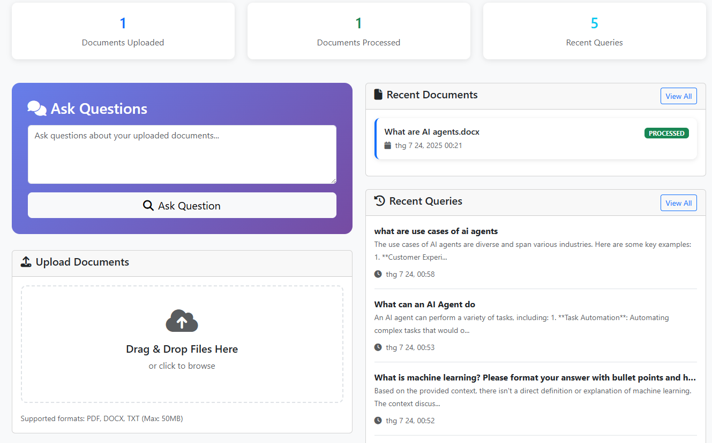

# Simple RAG Application

A complete RAG (Retrieval-Augmented Generation) application built with Spring Boot that allows users to upload documents, process them into vector embeddings, and query the content using natural language with AI-powered responses.

## 🚀 Features

- **Document Upload**: Support for PDF, DOCX, and TXT files
- **Text Processing**: Automatic text extraction and intelligent chunking
- **Vector Embeddings**: Document vectorization for semantic search using Ollama embeddings
- **Query Interface**: Natural language querying with contextual responses via Ollama LLM
- **Markdown Rendering**: AI responses rendered as formatted Markdown with proper styling
- **Document Management**: View, manage, and delete uploaded documents
- **Query History**: Track and review previous questions and answers
- **Responsive Web UI**: Modern Bootstrap-based interface
- **PostgreSQL Storage**: Efficient vector storage with pgvector extension

## 🔮 Future Enhancements

- **Multiple LLM Support**: Through Spring AI's unified API
- **Advanced RAG Techniques**: Hybrid search, re-ranking, and context optimization
- **Authentication & Authorization**: User management and secure access control

## 📸 Screenshots & Demo

### Main Interface
The application provides a clean, intuitive interface for document upload and AI-powered querying:



**Key Features Shown:**
- 📊 **Dashboard Statistics**: Document count, processing status, and query history
- 💬 **Query Interface**: Natural language question input with AI responses
- 📁 **Document Upload**: Drag & drop file upload with format support
- 📋 **Recent Activity**: Quick access to uploaded documents and query history
- 🎨 **Markdown Rendering**: Formatted AI responses with proper styling

*The interface demonstrates the RAG system in action with sample queries about AI agents, showing the system's ability to provide contextual, well-formatted responses based on uploaded documentation.*

## 🛠 Technology Stack

- **Backend**: Spring Boot 3.x, Java 17+
- **Database**: PostgreSQL with pgvector extension
- **ORM**: Spring Data JPA
- **Migration**: Liquibase
- **Frontend**: Thymeleaf, Bootstrap 5, Font Awesome
- **Document Processing**: Apache PDFBox, Apache POI
- **Build Tool**: Maven
- **Containerization**: Docker & Docker Compose
- **AI Integration**: Direct Ollama API integration for embeddings and chat completion (will migrate to Spring AI framework in future versions)
- **Markdown Support**: Client-side Markdown rendering using Marked.js for formatted AI responses

## 📋 Prerequisites

- Java 17 or higher
- Maven 3.6+
- Docker and Docker Compose
- Git

## 🏃‍♂️ Quick Start

### 1. Clone the Repository

```bash
git clone <repository-url>
cd simple-rag
```

### 2. Start PostgreSQL Database

```bash
docker-compose up -d
```

This will start:
- PostgreSQL 16 with pgvector extension on port 5432
- Automatic database initialization with required extensions

### 3. Build and Run the Application

```bash
mvn clean compile
mvn spring-boot:run
```

Or build and run the JAR:

```bash
mvn clean package
java -jar target/simple-rag-1.0.0.jar
```

### 4. Access the Application

Open your browser and navigate to:
- **Main Application**: http://localhost:8080
- **Documents Page**: http://localhost:8080/documents
- **Query History**: http://localhost:8080/queries

## 🔧 Configuration

### Database Configuration

The application is pre-configured to connect to the PostgreSQL instance started by Docker Compose:

```properties
spring.datasource.url=jdbc:postgresql://localhost:5432/simplerag
spring.datasource.username=raguser
spring.datasource.password=ragpassword
```

### File Upload Configuration

```properties
# File upload settings
spring.servlet.multipart.max-file-size=50MB
spring.servlet.multipart.max-request-size=50MB
app.file.upload-dir=./uploads
app.file.allowed-extensions=pdf,docx,txt
app.file.max-size=52428800
```

### Document Processing Configuration

```properties
# Document chunking settings
app.document.chunk-size=1000
app.document.chunk-overlap=200
app.document.max-chunks-per-document=500
```

## 🔌 API Endpoints

### Document Management
- `POST /documents/upload` - Upload a document
- `GET /documents` - List all documents
- `GET /documents/{id}` - Get document details
- `POST /documents/{id}/delete` - Delete a document
- `GET /documents/{id}/status` - Get document processing status (AJAX)

### Query Processing
- `POST /query` - Process a RAG query
- `POST /queries/ask` - Process query via AJAX
- `GET /queries` - View query history
- `GET /queries/{id}` - Get specific query details

### Pages
- `GET /` - Home page with upload and query interface
- `GET /documents` - Document management page
- `GET /queries` - Query history page

## 🐳 Docker Support

### Using Docker Compose (Recommended)

The included `docker-compose.yml` provides a complete development environment:

```bash
# Start all services
docker-compose up -d
```

## 🔧 Development

### Adding Ollama Integration

When Spring AI becomes available, the application is ready for integration:

1. Ensure Ollama is running:
```bash
# Install Ollama (visit https://ollama.ai for instructions)
ollama serve

# Pull required models
ollama pull qwen3:8b
ollama pull bge-m3
```

2. The `EmbeddingService` and `RagQueryService` are prepared for Spring AI integration
3. Update the service implementations to use the Spring AI components

### Database Migrations

Create new migration files in `src/main/resources/db/changelog/changes/`:

```bash
# Generate new migration
mvn liquibase:generateChangeLog

# Apply migrations
mvn liquibase:update

# Rollback last changeset
mvn liquibase:rollback -Dliquibase.rollbackCount=1
```

### Adding New Document Types

1. Update `TextExtractionService.java` to handle the new format
2. Add the file extension to `app.file.allowed-extensions` in `application.properties`
3. Update the file upload validation logic

## 📝 License

This project is licensed under the MIT License - see the LICENSE file for details.

